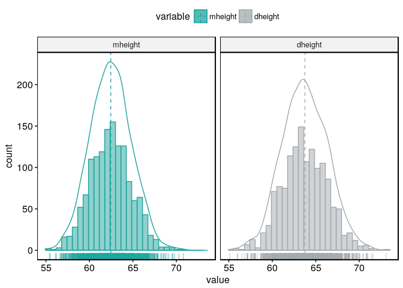

Confidence in the Sample Mean
================
Chase Baggett
September 12, 2017

Assignment 1
------------

### 1.1 Construct histograms of dheight and mheight. Do the data appear to be normally distributed?

The data does appear to be normally distibuted.

``` r
answers <- list()
library(alr4)
library(ggpubr)
library(reshape)
h_long = melt(Heights,id=NULL)
gghistogram(h_long, x = "value", bins = 30,facet.by="variable",
   add = "mean", rug = TRUE,add_density=TRUE,
   color = "variable", fill = "variable",
   palette = c("#20A39E", "#A4A9AD"))
```



### 1.2 Give the standard error of the average height for mothers.

``` r
std.error <- function(x){sd(x)/sqrt(length(x))}
std.error(Heights$mheight)
```

    ## [1] 0.06351241

### Give the standard error when height is measured in feet.

Per the lecture, we can do this conversion before or after, and get the same value, as shown below.

``` r
std.error(Heights$mheight)/12
```

    ## [1] 0.005292701

``` r
std.error(Heights$mheight/12)
```

    ## [1] 0.005292701

### 1.3 Give a 90% confidence interval for E(mheight) and provide a brief interpretation.

We know that our data is a sample of mothers. The central limit theorem tells us that the means of repeated sampling usually results in a normal distribution of sample means. We have the standard error which tells us the estimated standard deviation of those sample means.

We can use the standard error to give us an estimate of the confidence level for the repeated sampling-- ie, if we continue sampling mothers, what range can we expect the sample means to fall into.

We know from the properties of a normal distribution that 90% confidence corresponds to a 1.645 Z score.

Therefore, if we take 1.645 \* Our Standard Error, we find the range that we are 90% confident the sample means will fall into.

``` r
#Manual Calculation
low = mean(Heights$mheight)-1.645*std.error(Heights$mheight)
high = mean(Heights$mheight)+1.645*std.error(Heights$mheight)
print(paste("Mean:",mean(Heights$mheight,sep=" ")))
```

    ## [1] "Mean: 62.4528"

``` r
print(paste("Confidence Interval:",low,"to",high,sep=" "))
```

    ## [1] "Confidence Interval: 62.3483220819424 to 62.5572779180576"

``` r
#Base Package for Verification
test = t.test(x=Heights$mheight,mu=62.75,conf.level = .9)
test = paste(as.character(test$conf.int),collapse=' to ')
print(paste("Verification with Base Package:",test,sep=" "))
```

    ## [1] "Verification with Base Package: 62.3482608952343 to 62.5573391047657"

### 1.4 Construct the p-value for the hypothesis that E(mheight) = 62.75 inches versus the alternative that it is not.

P-Value for a sample mean having 62.75 inches.

``` r
x_mean <- mean(Heights$mheight)
x_se <- std.error(Heights$mheight)
 
x_bar <- 62.75
x_samples <- nrow(Heights)
 
t_dist <- (x_bar-x_mean)/x_se
2*pt(-abs(t_dist),df=x_samples-1)
```

    ## [1] 3.161029e-06

``` r
#Base Package for Verification
t.test(x=Heights$mheight,mu=62.75,conf.level = .9)$p.value
```

    ## [1] 3.161029e-06

1.5 Assume that mheight is normally distributed with population mean 62.5 inches and population variance 5.5 inches.
--------------------------------------------------------------------------------------------------------------------

### a. Find the probability that a randomly selected mother has height less than 68 inches.

``` r
pop_variance = 5.5
pop_mean = 62.5
pop_sd = sqrt(pop_variance)
z_score = (68 - pop_mean)/pop_sd
pnorm(z_score)
```

    ## [1] 0.9904918

``` r
#Alternatively, we can change the distribution rather than doing a z-score lookup.
pnorm(68, mean=pop_mean,sd = pop_sd)
```

    ## [1] 0.9904918

### b. Find the probability that a randomly selected mother has height between 60 and 65 inches.

We take the probability of the mother having a height under 65, and subtract from it the probability of the mother having a height under 60 inches, and we have the probability of the height being between the 60 and 65.

``` r
pnorm(65, mean=pop_mean,sd = pop_sd,lower.tail = T) - 
pnorm(60, mean=pop_mean,sd = pop_sd,lower.tail = T)
```

    ## [1] 0.713578

### c. The number v such that Pr(E(mheight) –v &lt; mheight &lt; E(mheight) + v) = 0.95.

``` r
#find the z-score for 95% confidence interval.
z_score = qnorm(.95)
#Multiply the standard deviation by the z score.
pop_sd * z_score
```

    ## [1] 3.857524

### d. The 0.25 quantile of mheight.

``` r
quantile(Heights$mheight,.25)
```

    ##  25% 
    ## 60.8

### e. The median and first quartile of mheight

``` r
quantile(Heights$mheight,c(.25,.5))
```

    ##  25%  50% 
    ## 60.8 62.4

### f. A 95% confidence interval for the height of a randomly selected mother.

``` r
low = mean(Heights$mheight)-1.96*sd(Heights$mheight)
high = mean(Heights$mheight)+1.96*sd(Heights$mheight)
print(paste("Mean:",mean(Heights$mheight,sep=" ")))
```

    ## [1] "Mean: 62.4528"

``` r
print(paste("Confidence Interval:",low,"to",high,sep=" "))
```

    ## [1] "Confidence Interval: 57.8367975788644 to 67.0688024211356"

1.6 Test the hypothesis that E(mheight) = E(dheight). This requires a t-test procedure that was not reviewed in lecture but is part of the prerequisites for this course. Caution: mheight and dheight are correlated.
----------------------------------------------------------------------------------------------------------------------------------------------------------------------------------------------------------------------

Using a two sampled T-test, we reject the hypothesis that E(mheight) - E(dheight) with 90% confidence.

``` r
t.test(x=Heights$mheight,y=Heights$dheight,conf.level = .9,alternative="two.sided")
```

    ## 
    ##  Welch Two Sample t-test
    ## 
    ## data:  Heights$mheight and Heights$dheight
    ## t = -13.723, df = 2721.5, p-value < 2.2e-16
    ## alternative hypothesis: true difference in means is not equal to 0
    ## 90 percent confidence interval:
    ##  -1.453921 -1.142588
    ## sample estimates:
    ## mean of x mean of y 
    ##  62.45280  63.75105
